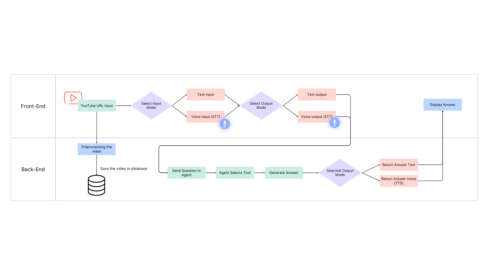

# Multimodal AI Chatbot for YouTube Videos 🎬🪄  
> "Ask questions. Get answers. Learn from any video — instantly and interactively."
...

## 📌 Overview

This project implements a **multimodal AI chatbot** that can answer questions about YouTube videos using both **text and voice inputs**.  
Users can:
- 🎯 Ask questions via voice or text
- 📑 Get text or audio responses
- 🧠 Take quizzes or generate summaries
---
## ✨ Project Presentation
 [Download Project Presentation](https://docs.google.com/presentation/d/1FrKcuqxVKZNMAbtsKAXvQ5JZHzWaUjgK/edit?usp=sharing&ouid=103884519830050993917&rtpof=true&sd=true)
---

## 🔄 System Flow
1. The user enters a YouTube video URL  
2. Chooses **input mode**: text or voice  
3. Chooses **output mode**: text or voice  
4. Backend:
   - Preprocessing the video
   - Stores the video URL in a database
   - Passes the question to the **agent**
   - Agent selects the appropriate tool (search, summary, quiz, etc.)
   - LLM generates a response
5. The response is returned to the user as text or speech



---

## Evaluation
* **Hallucination Detection:**
   - Compares the LLM's response with source data.
   - Calculates a hallucination score (0 = factual, 1 = fully hallucinated).

* **Retrieval Evaluation:**
   - Precision@K and Recall@K are computed to evaluate the relevance of retrieved content.

---

## How to Run the Project 🚀

Follow these steps to set up and run the project on your local machine:

### Step 1: Clone the Repository

First, clone the repository to your local machine using Git:

```bash
git clone <repository_url>
cd <repository_directory>
```
### Step 2: Install Dependencies
Install the required dependencies listed in requirements.txt:
```bash
pip install -r requirments.txt
```
### Step 3: Download the file 
Download the file Multimodel_YouTube_ChatBot.py and place it inside your project directory

### Step 4: Run the Application
Run the Streamlit application using the following command:
```bash
streamlit run youtube_chatbot_streamlit.py
```
---

## Usage Guide
```
Question: What is the “technological gaze,” and how does Elise Hu define it?

Answer: The "technological gaze" is defined by Elise Hu as an algorithmically driven perspective that people learn to internalize, perform for, and optimize for. It is a process where machines take in our data and learn to perform us in an endless feedback loop. This concept manifests itself in how we present ourselves online, often through the use of filters or editing tools to alter our appearance, driven in part by AI-generated beauty standards. Hu mentions how these digital alterations can impact real-world beauty standards, creating a gap between our real appearances and the filtered images we present online. The technological gaze can thus contribute to issues of self-image and perpetuates a narrow, potentially harmful standard of beauty.

📄 Source Chunks and Relevance Scores
```
---


🚀 Try it out (locally or on Streamlit Cloud).
Upload a video URL, ask your question, and receive spoken or written answers — instantly!


